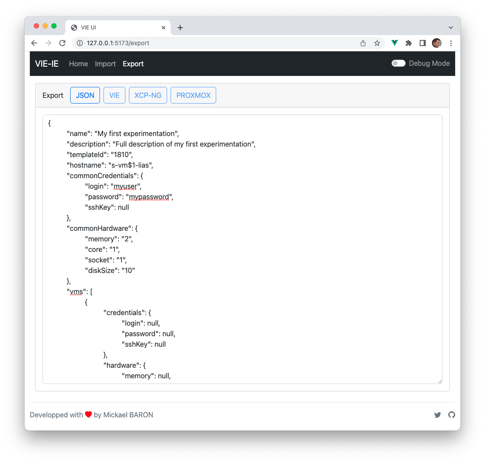
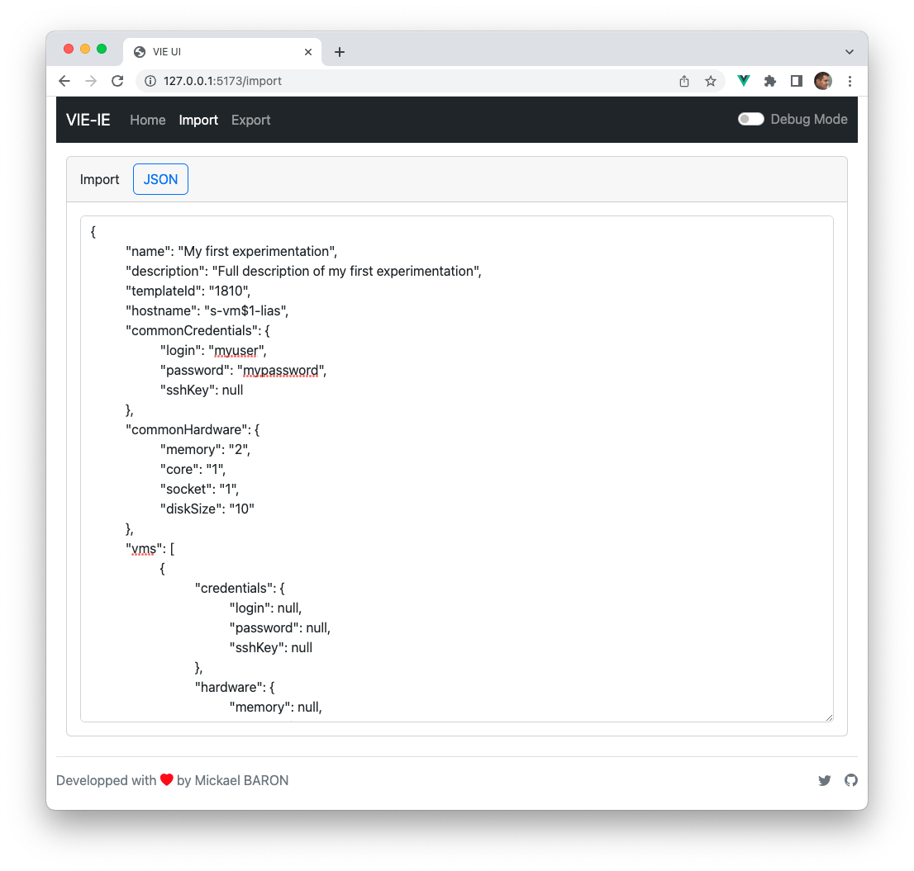

# Tutoriel Vue.js : savoir développer une application SPA (Single-Page Application)

L'objectif de cette série d'exercices est d'apprendre à développer une application SPA (*Single-Page Application*) avec le framework [Vue.js](https://vuejs.org/). Nous focaliserons les exercices sur le concept de **composant** en insistant sur la création et l'instanciation de composants, sur la communication entre ces composants et sur la mise en place d'un gestionnaire d'états.

Un seul cas d'étude est utilisé comme illustration pendant les exercices ce qui implique que tous les exercices de ce tutoriel se suivent. Ils ne sont pas indépendants. Toutefois, afin que vous puissez réaliser l'ensemble des exercices demandés, nous fournirons le code de la solution du précédent exercice dans l'exercice qui a suivi. 

Par ailleurs, comme l'objectif de cette série d'exercices est la manipulation de composants, nous vous fournirons une grande partie du code HTML et JavaScript.

[Vue.js](https://vuejs.org/) 3 a été utilisée pour cette série d'exercices. Cette série d'exercices est également disponible pour la version [Vue.js](https://vuejs.org/) 2 : [Branch Vue.js 2](https://github.com/mickaelbaron/vuejs-form-tutorial/tree/vuejs2).

**Buts pédagogiques** : identifier les composants d'une interface graphique, utiliser l'outil en ligne de commande [Vite](https://vitejs.dev/), développer un composant, instancier un composant, communiquer via un gestionnaire d'états, via des événements personnalisés, via des propriétés et enfin décrire et gérer des routes de navigation.

> Ce dépôt est utilisé dans le cadre d'un cours sur le développement d'applications web que je dispense en français à l'[ISAE-ENSMA](https://www.ensma.fr) pour les étudiants en dernière année du cycle d'ingénieur qui suivent l'option informatique. Tous les supports de cours et tutoriaux sont disponibles sur ma page personnelle : [https://mickael-baron.fr/](https://mickael-baron.fr/).

## Prérequis logiciels

* Éditeur de code [Visual Studio Code](https://code.visualstudio.com/) ;
* Navigateur web [Firefox](https://www.mozilla.org/firefox/) ou [Chrome](https://www.google.com/chrome/browser/desktop/index.html) ;
* Gestionnaire de paquet [npm](https://www.npmjs.com/).

## Présentation de l'étude de cas VIE

L'étude de cas présentée dans cette série d'exercices est une application appelée **VIE-UI** (Virtual machine Infrastructure for Experimentation User Interface). **VIE-UI** a pour objectif de fournir une interface graphique pour faciliter la saisie du DSL **VIE** (Virtual machine Infrastructure for Experimentation) afin de gérer une *Infrastructure as code*. Ce DSL permet de décrire la construction des ressources d'une infrastructure virtuelle. L'outillage proposé par **VIE** est utilisé au sein du [LIAS](https://www.lias-lab.fr) pour faciliter la mise en place de configurations de machines virtuelles pour effectuer des expérimentations requises par les chercheurs du laboratoire. Par exemple, il est possible de définir le nombre de machines virtuelles en caractérisant globalement ou pour chaque machine virtuelle les spécifications techniques telles que la mémoire, le nombre de cœur, le taille des disques dur, les configurations réseaux public et privé. C'est un outillage interne au [LIAS](https://www.lias-lab.fr) propose des fonctionnalités basiques. 

Un exemple d'utilisation du DSL **VIE** est fourni sur le code ci-dessous.

```other
[common]
memory=2
core=1
socket=1
template_id=1804
disk_size=10
hostname_template=s-vm$1-lias
user=mysuer
password=mypassword
sshkey=

[1]
public_net=217,66:7c:74:88:48:81
private_net=true
core=10
disk_size=30

[2]
private_net=true
```

La description de l'expérimentation ci-dessus précise que toutes les machines virtuelles possèderont des caractéristiques communes `[common]` : 2Go de mémoire, 1 CPU, 1 cœur par CPU et 10 Go de disque dur (l'unité de capacité par défaut est le Go). Les machines virtuelles se baseront sur le template décrit par l'identifiant `1804` et le nom des machines virtuelles devront suivre le template `s-vm$1-lias` où `$1` sera remplacée par le numéro de la machine virtuelle. Les caractéristiques spécifiques pour chaque machine virtuelle sont données par la suite. Deux machines virtuelles sont décrites. Pour la première machine virtuelle, le nombre de cœur est augmenté à 10 et la taille du disque est passée de 10 Go à 30 Go. La première machine virtuelle sera accessible via le réseau public et un réseau privé sera disponible pour communiquer avec la seonde machine virtuelle. Pour la seconde machine un réseau privé sera disponible.

**VIE-UI** fournit donc une interface graphique pour décrire sa description. Nous présentons ci-dessous les différents écrans.


Cette interface graphique contient dans la zone *Global Configuration* tous les champs communs à toutes les machines virtuelles. Un champ de texte *Virtual Machines* permet de préciser le nombre de machines virtuelles. Chaque machine virtuelle est décrite dans une zone où l'utilisateur peut ajouter ou supprimer des paramètres. Par exemple pour la machine virtuelle identifiée par *1*, quatre paramètres ont été ajoutés. Ils surchargeront les paramètres présents dans la zone *Global Configuration*. 



Cette interface graphique permet d'exporter le contenu de l'expérimentation saisie dans l'interface graphique de saisie. Plusieurs formats sont proposés, seul le format JSON est fonctionnel.



Cette interface graphique permet d'importer le contenu d'une précédente expérimentation. Seul le format JSON est supporté, celui généré par l'interface graphique d'exportation.

Vous noterez également la présence d'une barre de menu sur la partie haute des trois interfaces graphiques. Selon l'interface graphique active, les éléments de la barre de menu (*Home*, *Import* et *Export*) sont mis en gras. Un bouton *Debug Mode* permet d'activer ou pas l'affichage sur la console du navigateur.

## Ressources

Retrouver les autres tutoriels :

* [Tutoriel sur l'intégration de la bibilothèque Vue.js dans un site web existant](https://github.com/mickaelbaron/vuejs-form-tutorial) ;
* [Article sur les généralités des frameworks web JavaScript et sur la présentation de Vue.js](https://mickael-baron.fr/web/vuejs-generalites-part1) ;
* [Article sur la mise en œuvre des concepts de Vue.js](https://mickael-baron.fr/web/vuejs-miseenoeuvre-part2) ;
* [Article sur le déploiement d'une application web développée avec Vue.js](https://mickael-baron.fr/web/vuejs-deploiement-part3).

Pour aller plus loin, vous pouvez consulter les ressources suivantes :

* [Introduction au développement web avec des composants](https://mickael-baron.fr/web/intro-developpement-web-composant) ;
* [Introduction au développement Web avec Vue.js](https://mickael-baron.fr/web/intro-vuejs).