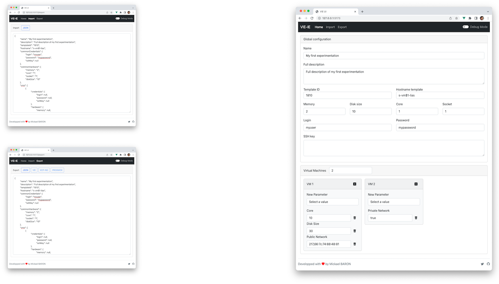

# Exercice 1 : savoir réaliser une conception à partir d'une maquette graphique

Ce premier exercice propose de réaliser une conception à partir d'une maquette composée d'interfaces graphiques sans possibilité d'interaction. Cette conception permettra d'identifier les composants à développer et choisir les techniques de communication entre ces mêmes composants. Une fois clairement spécifiée, ces composants seront développés dans la suite des exercices.

La maquette graphique a été développée préalablement en utilisant HTML et CSS via la bibliothèque CSS [Boostrap](https://getbootstrap.com/). Cette maquette est fournie dans le répertoire _htmldesign/_.

## But

* Identifier des composants à partir d'une maquette graphique.
* Choisir des techniques de communication entre composant (propriété, événement personnalisé ou gestionnaire d'état).

## Étapes à suivre

* Depuis le répertoire _htmldesign/_, ouvrir les différents fichiers HTML dans un navigateur web (_export.html_, _import.html_ et _index.html_). Pour rappel, les écrans correspondants ont été présentés ici : [README.md](../README.MD).

* Identifier les six composants portant les noms suivants : *MenuBar*, *Footer*, *Global*, *VirtualMachine*, *VirtualMachineElement*, *Export* et *Import*.



> Pour identifier les composants, vous pouvez examiner sur les interfaces graphiques des blocs qui se répètent ou qui ont un sens fonctionnel spécifique. Faites attention à ne pas proposer un découpage trop fin car cela impactera le nombre de composants et par conséquent le temps de développement s'en trouverait augmenté. La difficulté de ce type de conception est d'obtenir un bon compromis sur le nombre de composants.

* Définir un arbre de composants qui mettra en évidence les composants parents et les composants enfants. Le composant racine s'appellera *App*. Vous donnerez également la cardinalité au niveau de la relation composant parent et composant enfant (`1`, `0..n` ou `1..n`).

La communication entre tous les composants sera réalisée principalement par un gestionnaire d'état qui est un modèle qui partage les données entre tous les composants. Les valeurs des champs de texte proposés dans l'interface graphique se retrouveront stockées dans ce gestionnaire d'états à savoir `name`, `description`, `templateId`, `hostname`, `login`, `password`, `sshKey`, `memory`, `core`, `socket`, `diskSize` et un tableau de machine virtuelle dont la structure permettra de surcharger les valeurs de la zone *Global Configuration*.

Les composants *VirtualMachine* et *VirtualMachineElement* utiliseront en plus la communication par propriétés (*Props*). Cette communication servira à associer une instance d'un composant par rapport au contenu fourni par le gestionnaire d'état. Par exemple, la description d'une machine virtuelle est détaillée dans le composant *VirtualMachine*. L'index du tableau `vms` sera utilisé pour identifier une instance du composant *VirtualMachine*. Ce type de communication nécessite de déclarer des propriétés au niveau du composant enfant (ici *VirtualMachine* et *VirtualMachineElement*). Pour chaque propriété, il faudra préciser un nom, un type et le caractère obligatoire de la propriété. Concrètement dans notre exemple, le composant *VirtualMachine* devra déclarer une propriété obligatoire nommée `currentIndex` et de type `Number`. Le composant parent *Global* devra transmettre pour les création des instances du composant *VirtualMachine*, un nombre pour la propriété `currentIndex`.

* Pour le composant *VirtualMachine*, définir le contenu nécessaire pour réaliser la communication par propriétés. Vous préciserez notamment pour chaque propriété leur nom, leur type et leur caractère obligatoire.

> ASTUCE : une propriété devra être définie.

* Pour le composant *VirtualMachineElement*, définir le contenu nécessaire pour réaliser la communication par propriétés. Vous préciserez notamment pour chaque propriété leur nom, leur type et leur caractère obligatoire.

> ASTUCE : trois propriétés devront être définies.

* Examiner le code HTML du fichier _index.html_ et vous remarquerez que dans la partie `<head>` deux déclarations de bibliothèques CSS sont faites comme montrées sur le code ci-dessous.

```html
<head>
    <meta charset="utf-8">
    <meta name="viewport" content="width=device-width, initial-scale=1">

    <!-- Bootstrap CSS -->
    <link href="https://cdn.jsdelivr.net/npm/bootstrap@5.2.2/dist/css/bootstrap.min.css" rel="stylesheet">
    <link rel="stylesheet" href="https://cdn.jsdelivr.net/npm/bootstrap-icons@1.9.1/font/bootstrap-icons.css">    
</head>
```